# Task 1:

1. Rename the "Delete" button to "Delete Contact" in Contact.js
   
   
   

2. Rename the "Add" button to "Add {contact.name}" in NewPhone.js
   
   
   

3. Select file NewPhone.js then replace

   <input
   type="text"
   placeholder="Name"
   onChange={(e) => setName(e.target.value)}
   value={name}
   />

by

<select value={name} onChange={(e) => setName(e.target.value)}>

<option value="">Select Category</option>
<option value="home">Home</option>
<option value="work">Work</option>
<option value="mobile">Mobile</option>
<option value="other">Other</option>
</select>

to display the drop-menu with 4 categories

4.Select file PhoneList.js then in the <tr> element of the table change the label "Name" to "Phone Type"

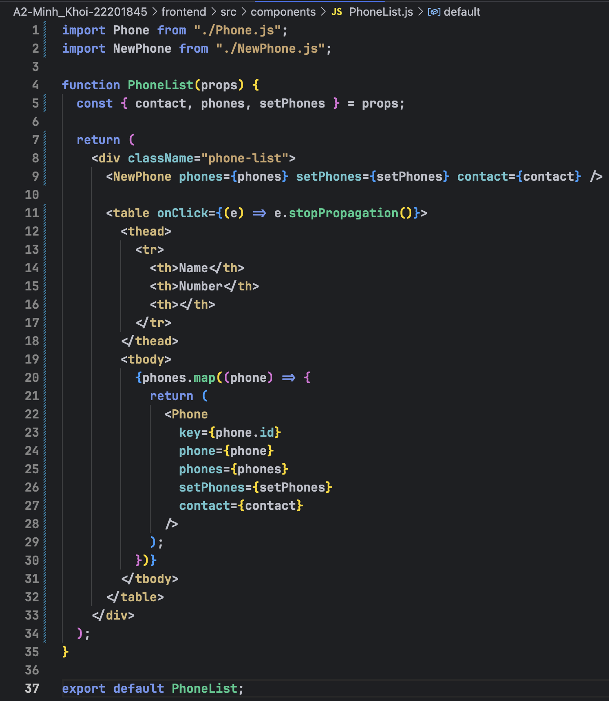

## task 2:

1. Show Contact
   
2. Add Contact
   
3. Delete Contact
   
4. Update Contact
   
5. Show Phone
   
6. Add Phone
   
7. Delete Phone
   
8. Update Phone
   

### task 3:

1. Modified the contacts table to include the "id", "Name" and "Address"

- before

- after

- before

-after

2. Modified the phones table to include "id", "phone_type", "phone_number", and "contact_id"

- Before

- After

  

- before

  

- after

  

3. Adjusted the front_end to reflect these database changes
   
   
   
   
   
   
   
   

4. Tested all APIs associated with the modified tables:

- GET contacts

- POST contacts

- DELETE contacts

- PUT contacts

- GET phones

- POST phones

- DELETE phones

- PUT phones

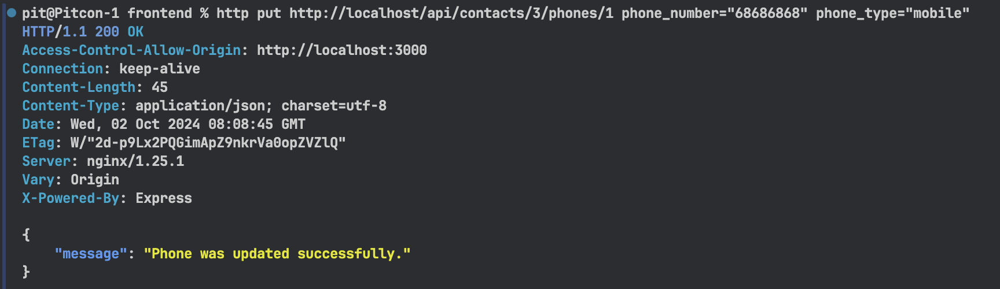

\*Front-end user

### task 4:

1-1. Create a new file named `company.model.js` in `./api/models` then define the `Company` model

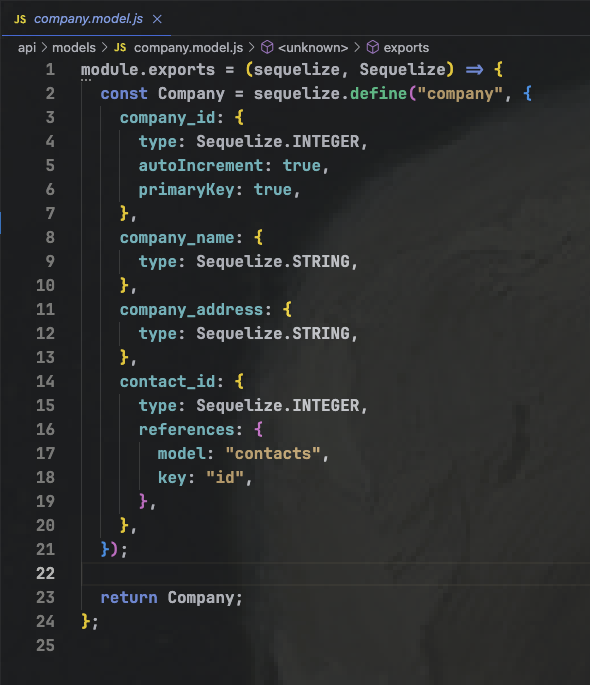

1-2. Import new `company.model.js` sequelize file to PostgreSQL database via `./api/models/index.js` **_line-25_**

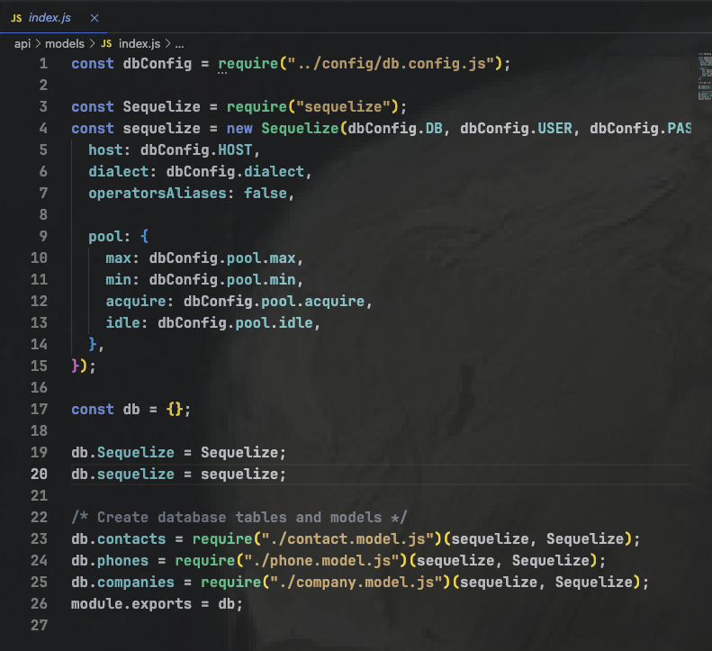

1-3. Check the database after configured `./api/models/index.js`

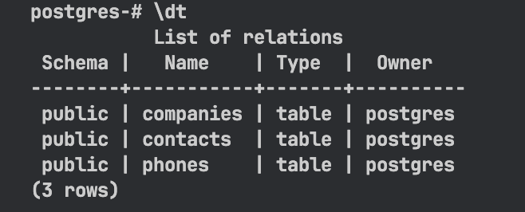

2-1. Create a new controller file for `company` named `company.controller.js` in `./api/controllers/` and import database from `./models` then define `const Company` to make sure the Combany model can access from databse object

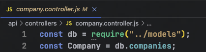

2-2. Create a new company for specific contact method in `company.controller.js`

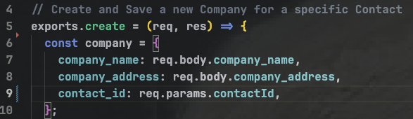

2-3. Create a save company in the database

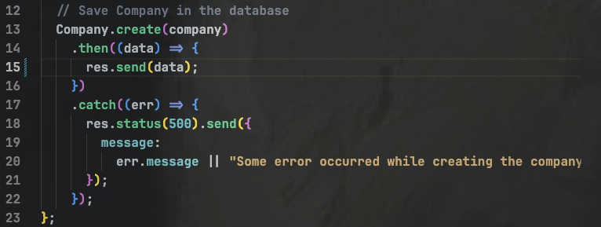

2-4. Create a get all companies associated with a specific contact method in `company.controller.js`

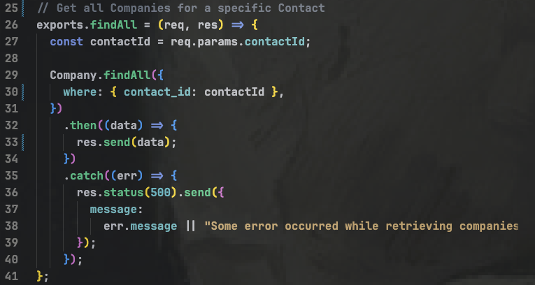

2-5. Create get a single company based on both the `companyId` and `contactId` method in `company.controller.js`

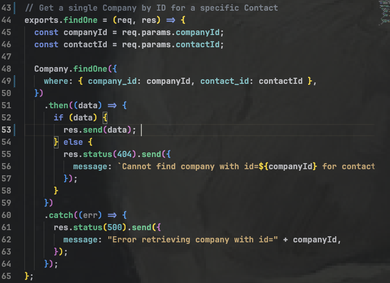

2-6. Create a updates a company's details based on the `companyId` and `contactId` method in `company.controller.js`

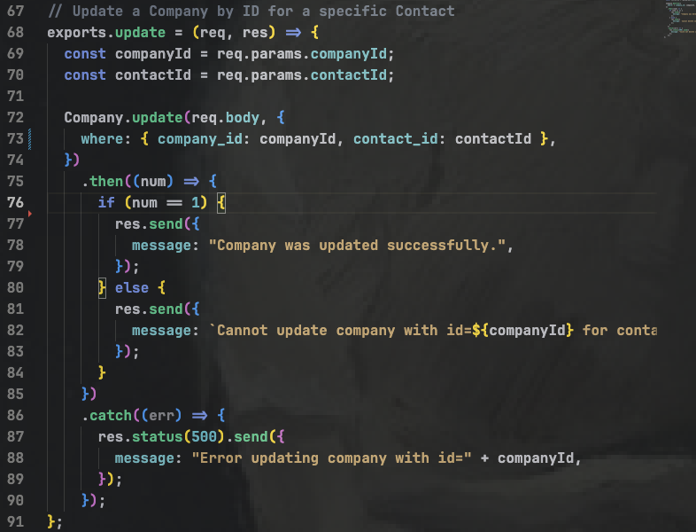

2-7. Create a deletes a company from the database based on the `companyId` and `contactId` method in `company.controller.js`

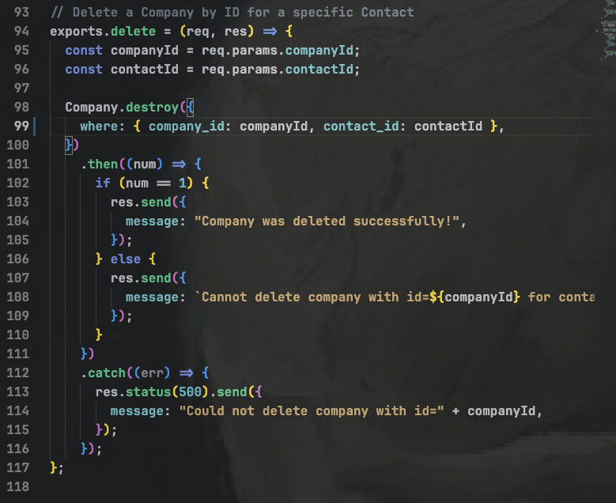

2-8. Create a file called `companies.routes.js` in ./api/routes to define the API endpoints for interacting with the company resources

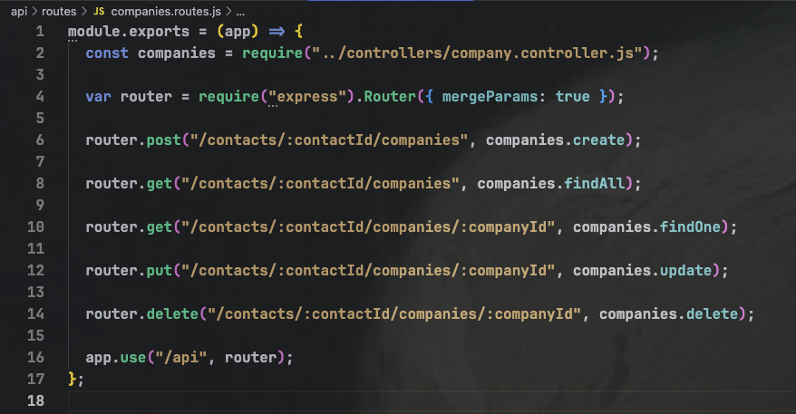

2-9.

- Register the routes in main app file which is `app.js` in `./api/app.js`

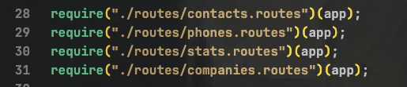

3. API testing

- POST company

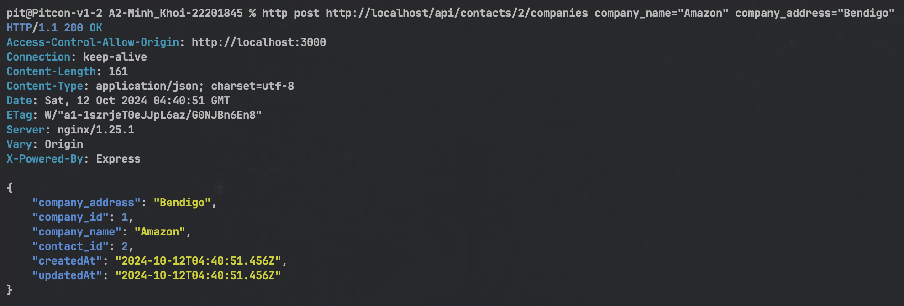

- GET company

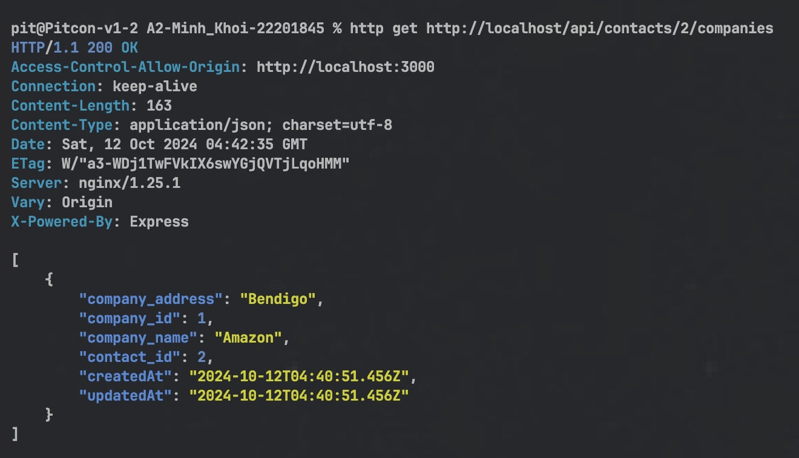

- PUT company

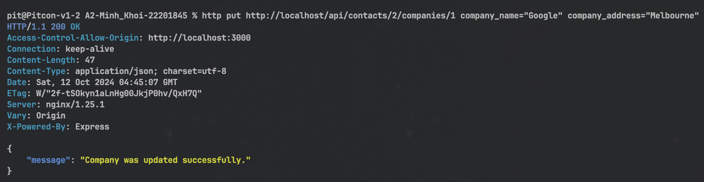

- DELETE company

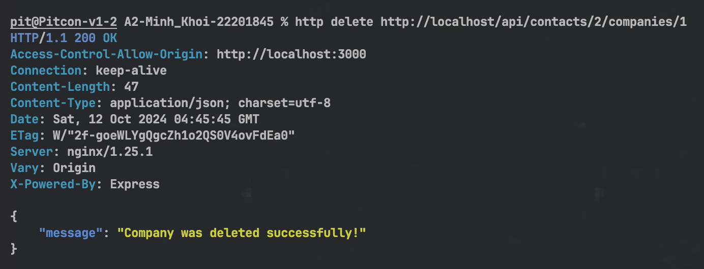

##### task 5:

1.1. To ensure including all function sort of adding, edditing, deleting and updating records we have to create 3 files `Companylist.js`, `Company.js`, `NewCompany.js`

1.2. For adding a new company via front-end, create `NewCompany.js` in `./src/components`

- This component contains a form to allow the user to add a new company and linked through back-end and connected to database.

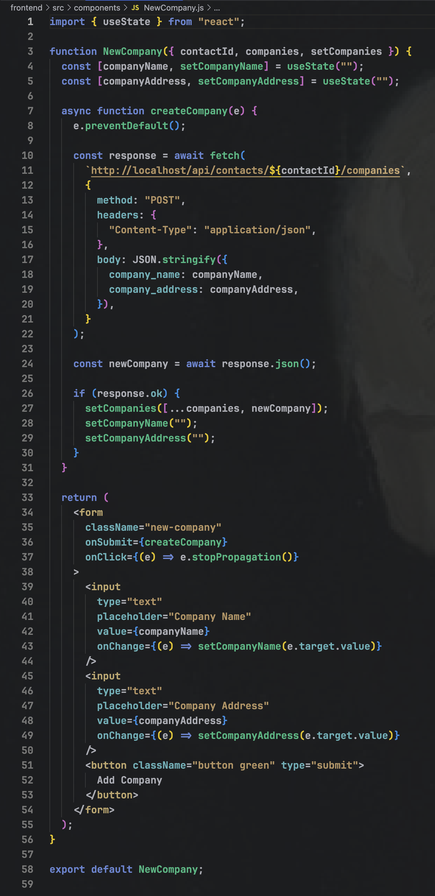

1.3. For displays a company and edit or delete buttons via front-end, create `Company.js` in `./src/components` to appear those function

- This component is responsible for rendering a single company in the data also provides the functionality to edit and delete a company.

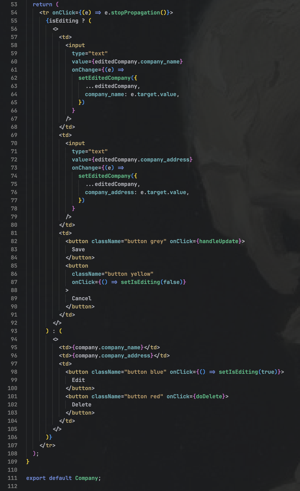

1.4. For the main componenent that handles the list of companies for a specific contact, create `Companylist.js` in `./src/components`

- This component acts as the parent components for `Company` and `Newcompany`. It fetches the list of companies from the back-end and renders each company in a table row.

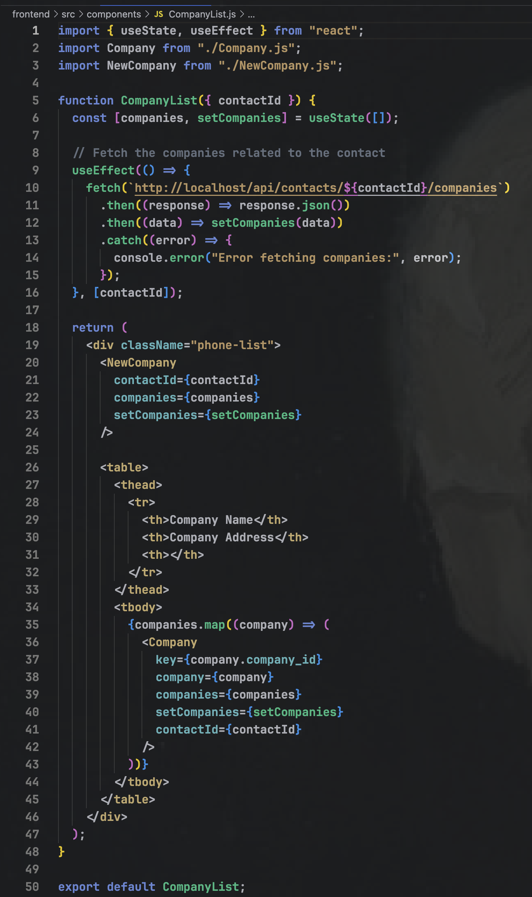

1.5. After creeated 3 component files the last but not list step is intergrating `CompanyList` into `Contact.js` to ensure that `companies` is related to each contacts are displayed below the contact's detail, alongside phone numbers.

**_Line 58_**

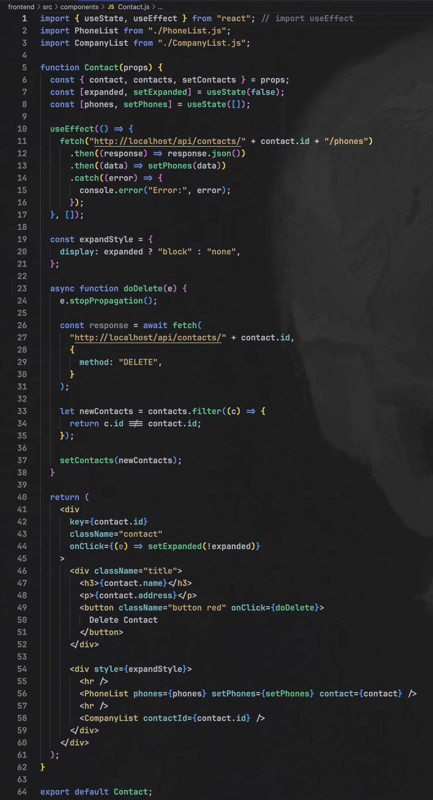

/\* Front-end user:

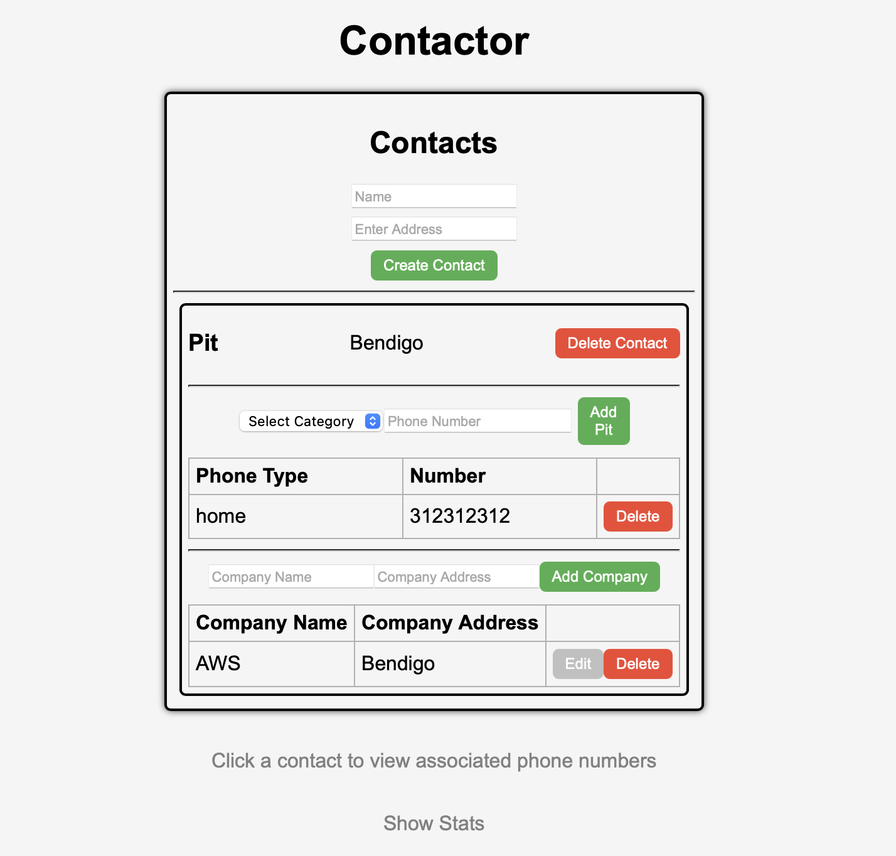
